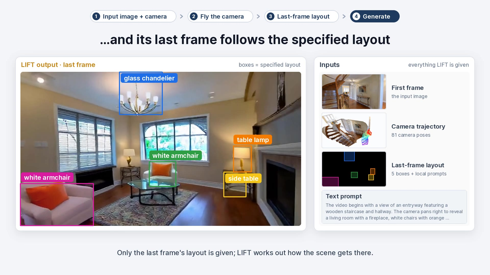
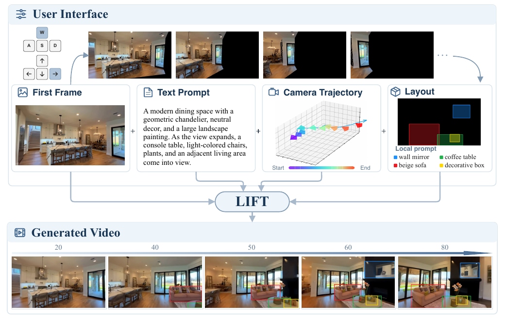
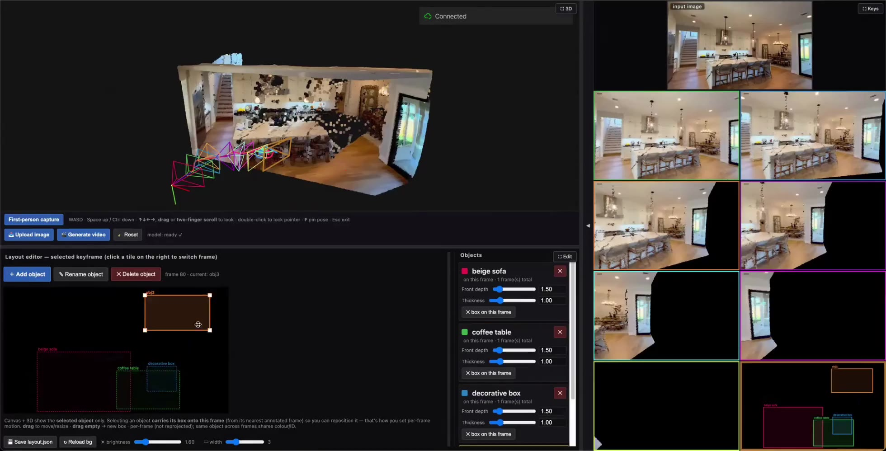

# LIFT: Layout-In-Future Video Generation under Large Viewpoint Change via On-Policy Self-Distillation

<p align="center">
  <a href="https://scholar.google.com/citations?user=taEqnmcAAAAJ&hl=en">Shengxiang Ji</a><sup>1</sup>,
  <a href="https://kiteretsu77.github.io/BoyangWang/">Boyang Wang</a><sup>2</sup>,
  <a href="https://xxuhaiyang.github.io/">Haiyang Xu</a><sup>1</sup>,
  <a href="https://www.bingnanli.com/">Bingnan Li</a><sup>1</sup>,
  <a href="https://myc634.github.io/yuchengmao/">Yucheng Mao</a><sup>1</sup>,
  <a href="https://zeyuan-chen.com/">Zeyuan Chen</a><sup>1</sup>,<br>
  <a href="https://x.com/shan_xiaojun">Xiaojun Shan</a><sup>1</sup>,
  <a href="https://xzhang.dev/">Xiang Zhang</a><sup>3</sup>,
  <a href="https://www.ganghua.org/">Gang Hua</a><sup>4</sup>,
  <a href="https://faculty.stat.ucla.edu/jxie/">Jianwen Xie</a><sup>5</sup>,
  <a href="https://www.cs.virginia.edu/~zc3bp/">Zezhou Cheng</a><sup>2</sup>,
  <a href="https://pages.ucsd.edu/~ztu/">Zhuowen Tu</a><sup>1&dagger;</sup>
</p>
<p align="center">
  <sup>1</sup>University of California, San Diego &nbsp; <sup>2</sup>University of Virginia &nbsp; <sup>3</sup>Meta &nbsp; <sup>4</sup>Amazon &nbsp; <sup>5</sup>Lambda<br>
  <sup>&dagger;</sup>Corresponding author
</p>

<p align="center">
  <a href="https://jsxzs.github.io/LIFT"></a>
  <!-- <a href="https://arxiv.org/abs/XXXX.XXXXX"></a> -->
  <a href="https://huggingface.co/datasets/Overdog/LIFT-Vista"></a>
  <a href="https://huggingface.co/Overdog/LIFT"></a>
</p>

<p align="center">
  <a href="assets/teaser_video.mp4"></a>
</p>
<p align="center"><em>Click the image to play the teaser video: input image + camera → fly the camera → last-frame layout → generate.</em></p>

<p align="center">
  
</p>
<p align="center">
  <em>Given a first frame, users can navigate from the first-frame view along a desired camera path and specify layouts using bounding boxes with local text prompts in the final frame. Then, <b>LIFT</b> generates the intended shot that transitions from the input image to the user-defined last-frame layout following the prescribed camera trajectory.</em>
</p>

## 📌 TL;DR

- **Joint Camera and Future-Layout Control:** LIFT is a unified video generation framework that enables users to
   control both camera motion and the semantic-spatial composition of newly revealed regions using only a
   last-frame layout.
- **Dual-mode OPSD Training:** We use a dense spatiotemporal layout teacher to train a shared student in both the
   single-condition mode (conditioned only on the camera trajectory) and the dual-condition mode (conditioned on
   both the camera trajectory and the last-frame layout).
- **LIFT-Vista:** We curate a dataset with large viewpoint changes and joint camera and layout annotations.

## 🛠️ Installation
### Option A: Conda Environment
```bash
git clone https://github.com/jsxzs/LIFT.git && cd LIFT
conda create -n lift python=3.12 -y && conda activate lift
pip install -r requirements.txt --extra-index-url https://download.pytorch.org/whl/cu126

# Install flash attention
pip install https://github.com/mjun0812/flash-attention-prebuild-wheels/releases/download/v0.9.48/flash_attn-2.8.3+cu126torch2.13-cp312-cp312-manylinux_2_34_aarch64.whl
```

### Option B: Apptainer Image
```bash
git clone https://github.com/jsxzs/LIFT.git && cd LIFT
apptainer build --fakeroot LIFT.sif env.def
apptainer exec --nv --cleanenv --env PYTHONPATH=$PWD LIFT.sif
```

## 📦 Model Weights and Dataset

| Resource | Hugging Face | Content |
|---|---|---|
| LIFT checkpoint | [Download](https://huggingface.co/Overdog/LIFT) | Dense-layout teacher (stage2); and dual-mode OPSD student (stage3, our final model), one set of weights for both the camera-only and the camera + last-frame-layout mode |
| LIFT-Vista dataset | [Download](https://huggingface.co/datasets/Overdog/LIFT-Vista) | 81-frame, 16 FPS clips with large viewpoint change, per-frame camera trajectories and layout annotation |
| Wan2.1 Base model | [Download](https://huggingface.co/alibaba-pai/Wan2.1-Fun-V1.1-1.3B-Control-Camera) | VAE, T5 text encoder, CLIP image encoder, tokenizer, and the DiT that LIFT is fine-tuned from |

```bash
pip install -U "huggingface_hub[cli]"
mkdir -p models
# base model
hf download alibaba-pai/Wan2.1-Fun-V1.1-1.3B-Control-Camera --local-dir models/Wan2.1-Fun-V1.1-1.3B-Control-Camera
# LIFT checkpoints: models/LIFT/transformer (the released model) + models/LIFT_dense_layout_teacher (only for OPSD training)
hf download Overdog/LIFT --local-dir models/LIFT
# LIFT-Vista dataset
hf download Overdog/LIFT-Vista --repo-type dataset --local-dir data/LIFT-Vista
```

## 🎬 Inference
We provide one example, `examples/example1/`.
The example folder has the following files:

| File | Content |
|---|---|
| `first_frame.png` | the conditioning image |
| `camera.npz` | `extrinsic` world-to-camera matrices and `intrinsic` pixel-unit camera matrices at the image resolution |
| `layout_lastframe.json` | `{"instances": [{"id", "category", "bbox": [x0,y0,x1,y1], "caption"}, ...]}`, boxes in the pixel coordinates of `first_frame.png`|
| `caption.txt` | the global text prompt |
| `layout_dense.json` | dense per-frame layout of the same objects, `"bboxes": {"<frame>": [x0,y0,x1,y1], ...}` (for the dense-layout demo below) |

```bash
# give only last-frame layout
python scripts/infer.py \
  --transformer_dir models/LIFT/transformer \
  --image examples/example1/first_frame.png --camera examples/example1/camera.npz \
  --layout examples/example1/layout_lastframe.json \
  --prompt_file examples/example1/caption.txt --output outputs/example1.mp4

# give dense per-frame layout
python scripts/infer.py \
  --transformer_dir models/LIFT_dense_layout_teacher/transformer \
  --image examples/example1/first_frame.png --camera examples/example1/camera.npz \
  --layout_dense examples/example1/layout_dense.json \
  --prompt_file examples/example1/caption.txt --output outputs/example1_dense.mp4
```

## 🏋️ Training

### Data Format

Both trainers read a CSV with one clip per row. The columns that are used:

| Column | Meaning |
|---|---|
| `UID` | clip id |
| `Video_Path` | 81-frame clip (mp4), the frames the model is trained to reproduce; absolute, or relative to the CSV's directory (or to `--data_root`) |
| `resolution` | clip resolution, `WxH` |
| `caption` | global text prompt |
| `Annotation_Path` | directory holding the files below (absolute or relative, like `Video_Path`) |
| `CameraFile` | camera `.npz` inside `Annotation_Path` (`extrinsic` (81,3,4) w2c, `intrinsic` (81,3,3) pixels), same format as `examples/example1/camera.npz` |
| `sam3_track_file` | per-object box tracks inside `Annotation_Path`: `{"tracks": {"<id>": {"id", "category", "caption", "bboxes": {"<frame>": [x0,y0,x1,y1], ...}}, ...}}` |
| `sam3_track_resolution` | resolution the track boxes are expressed in, `WxH` |

### Dense Layout SFT

```bash
TRAIN_CSV=/path/to/train.csv VAL_CSV=/path/to/val.csv \
bash scripts/train_dense_layout.sh
```

`scripts/train_wan21_camlayout.py` is a standard flow-matching fine-tune of the whole transformer.

### Dual-Mode On-Policy Self-Distillation (OPSD)

```bash
TEACHER=models/LIFT_dense_layout_teacher/transformer/diffusion_pytorch_model.safetensors \
TRAIN_CSV=/path/to/train.csv VAL_CSV=/path/to/val.csv \
bash scripts/train_opsd.sh
```

`scripts/train_wan21_camlayout_opd.py` keeps the frozen dense-layout teacher and trains a student initialized from it. 

## 🖥️ UI Demo

The `UI/` directory provides an interactive interface for running and visualizing LIFT.

<p align="center">
  <a href="assets/ui_demo.mp4"></a>
</p>
<p align="center"><em>Click the image to play the demo video: point-cloud view, first-person trajectory capture, keyframe tiles, last-frame layout editing and one-click generation.</em></p>

### Installation

Install the additional dependencies required by the UI:

```bash
pip install -r UI/requirements.txt
pip install git+https://github.com/microsoft/MoGe.git
pip install huggingface-hub==0.30.2
```


### Run the UI

Run the viewer on a GPU machine after downloading the LIFT model weights described in the **Model Weights** section.

```bash
# Start the UI and pre-load ../examples/example1
cd UI && CLIP=../examples/example1 ./run_viewer_gpu.sh

# Start with an empty scene and upload inputs from the browser
cd UI && CLIP=none ./run_viewer_gpu.sh
```

The UI is available at [http://localhost:8080/](http://localhost:8080/).

You can also pre-load a custom example directory:

```bash
cd UI
./run_viewer_gpu.sh <dir>
```

### Input Options

The upload panel supports two types of input:

1. **Single image**

   Upload an image directly in the browser. MoGe automatically estimates the point cloud and the first-frame camera.

   You can then:
   - specify the camera trajectory;
   - preview the corresponding keyframe views; and
   - draw bounding boxes for the target last-frame layout.

2. **Example folder**

   Upload a complete example folder to directly load the camera trajectory and last-frame layout. In this case, the keyframe views and layout boxes are displayed automatically, without requiring manual drawing.

   A folder should follow the `examples/example1` format and contain:

   ```text
   <dir>/
   ├── first_frame.png
   ├── camera.npz
   ├── caption.txt
   └── layout_lastframe.json
   ```

   No point cloud file is needed: MoGe estimates it from the image, both for a browser upload and for a folder
   pre-loaded from the command line (`./run_viewer_gpu.sh <dir>`). A pre-loaded folder may ship a precomputed
   `pcd_moge.npz` (as `examples/example1` does) to skip that step; it can be made with
   `python UI/viewer/estimate_pcd.py --clip <dir> --use-clip-intrinsic`.

### Session Files

All files read or generated by the editor are stored in a per-run session directory under:

```text
UI/.ui_sessions/
```

A session may contain:

```text
camera_da3_edited.npz
layout_edited.json
generated/
```

as well as copies of the pre-loaded inputs and browser uploads.

The original source directory is **never modified**.

### Reset

Click **Reset** to clear the current scene and start again with another image or example folder.

## 🙏 Acknowledgements

This code base builds on [VideoX-Fun](https://github.com/aigc-apps/VideoX-Fun) and
[Wan2.1](https://github.com/Wan-Video/Wan2.1).

## 📄 License

Released under the Apache License 2.0 (see `LICENSE`). The Wan2.1-Fun base model is subject to its own license.

<!-- ## 📚 Citation

```bibtex
``` -->
